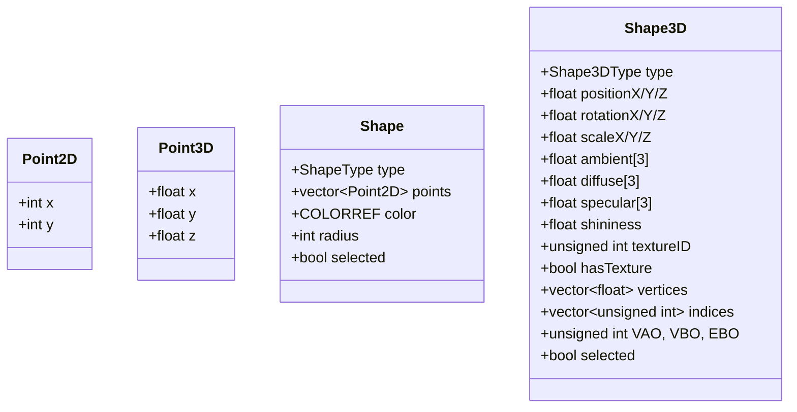

# 设计文档：代码重构与中文注释

## 概述

本设计文档描述了如何重构计算机图形学实验系统的代码，使其更易于理解和维护。主要目标是：
1. 将过长的代码文件拆分为更小的、职责单一的模块
2. 添加完整的中文注释，便于验收时讲解
3. 创建代码导航文档，帮助快速定位功能实现

## 架构

### 当前项目结构
```
ComputerGraphics/
├── src/
│   ├── core/           # 核心数据结构
│   │   ├── Point2D.h   # 二维点
│   │   ├── Point3D.h   # 三维点
│   │   ├── Shape.h     # 二维图形结构
│   │   ├── Shape3D.h   # 三维图形结构
│   │   └── DrawMode.h  # 绘图模式枚举
│   ├── algorithms/     # 图形算法
│   │   ├── LineDrawer.*        # 直线绘制算法
│   │   ├── CircleDrawer.*      # 圆形绘制算法
│   │   ├── FillAlgorithms.*    # 填充算法
│   │   ├── ClippingAlgorithms.*# 裁剪算法
│   │   ├── TransformAlgorithms.*# 几何变换
│   │   ├── MeshGenerator.*     # 3D网格生成
│   │   ├── ShaderManager.*     # 着色器管理
│   │   └── TextureLoader.*     # 纹理加载
│   ├── engine/         # 图形引擎
│   │   ├── GraphicsEngine.*    # 2D图形引擎
│   │   ├── GraphicsEngine3D.*  # 3D图形引擎（需拆分）
│   │   ├── ShapeRenderer.*     # 图形渲染器
│   │   ├── ShapeSelector.*     # 图形选择器
│   │   └── OpenGLFunctions.h   # OpenGL函数声明
│   ├── ui/             # 用户界面
│   │   ├── Dialogs3D.*         # 3D对话框（需拆分）
│   │   └── MenuIDs.h           # 菜单ID定义
│   └── main.cpp        # 程序入口
```

### 重构后的项目结构
```
ComputerGraphics/
├── src/
│   ├── core/           # 核心数据结构（不变）
│   ├── math/           # 数学工具（新增）
│   │   └── Matrix4.h   # 4x4矩阵运算
│   ├── algorithms/     # 图形算法（不变）
│   ├── engine/         # 图形引擎
│   │   ├── GraphicsEngine.*        # 2D图形引擎
│   │   ├── GraphicsEngine3D.h      # 3D引擎头文件
│   │   ├── GraphicsEngine3D_Core.cpp    # 初始化和OpenGL上下文
│   │   ├── GraphicsEngine3D_Render.cpp  # 渲染相关
│   │   ├── GraphicsEngine3D_Input.cpp   # 鼠标交互
│   │   └── ...
│   ├── ui/             # 用户界面
│   │   ├── TransformDialog3D.cpp   # 变换对话框
│   │   ├── LightingDialog.cpp      # 光照对话框
│   │   ├── MaterialDialog.cpp      # 材质对话框
│   │   ├── TextureDialog.cpp       # 纹理对话框
│   │   ├── Dialogs3D.h             # 对话框头文件
│   │   └── MenuIDs.h
│   └── main.cpp
├── Docs/
│   └── CODE_NAVIGATION.md  # 代码导航文档（新增）
```

## 组件和接口

### 1. Matrix4 数学模块

从 `GraphicsEngine3D.cpp` 中提取矩阵运算代码，创建独立的数学模块。

```cpp
// ComputerGraphics/src/math/Matrix4.h

/**
 * @file Matrix4.h
 * @brief 4x4矩阵运算类
 * 
 * 用于3D图形变换的矩阵运算，包括：
 * - 透视投影矩阵
 * - 视图矩阵（lookAt）
 * - 模型变换矩阵（平移、旋转、缩放）
 */
struct Matrix4 {
    float m[16];  ///< 列主序存储的4x4矩阵
    
    Matrix4();                                    // 单位矩阵
    static Matrix4 perspective(...);              // 透视投影
    static Matrix4 lookAt(...);                   // 视图矩阵
    static Matrix4 translate(float x, y, z);      // 平移矩阵
    static Matrix4 rotateX/Y/Z(float angle);      // 旋转矩阵
    static Matrix4 scale(float x, y, z);          // 缩放矩阵
    Matrix4 multiply(const Matrix4& other) const; // 矩阵乘法
};
```

### 2. GraphicsEngine3D 拆分方案

将1299行的 `GraphicsEngine3D.cpp` 拆分为3个文件：

#### 2.1 GraphicsEngine3D_Core.cpp（约300行）
```cpp
// 包含内容：
// - 构造函数/析构函数
// - Initialize() - OpenGL初始化
// - Shutdown() - 资源清理
// - CreateOpenGLContext() - 创建OpenGL上下文
// - LoadOpenGLFunctions() - 加载OpenGL函数指针
// - ReleaseContext() - 释放上下文
// - UpdateLight() - 更新光照参数
```

#### 2.2 GraphicsEngine3D_Render.cpp（约400行）
```cpp
// 包含内容：
// - Render() - 主渲染函数
// - RenderWithFixedPipeline() - 固定管线渲染
// - RenderCubeImmediate() - 立即模式渲染立方体
// - RenderSphereImmediate() - 立即模式渲染球体
// - RenderCylinderImmediate() - 立即模式渲染圆柱体
// - RenderPlaneImmediate() - 立即模式渲染平面
```

#### 2.3 GraphicsEngine3D_Input.cpp（约400行）
```cpp
// 包含内容：
// - OnLButtonDown/Up() - 鼠标左键事件
// - OnRButtonDown/Up() - 鼠标右键事件
// - OnLButtonDoubleClick() - 双击事件
// - OnMouseMove() - 鼠标移动事件
// - OnMouseWheel() - 滚轮事件
// - HandleShapeCreation() - 图形创建处理
// - HandleSelection() - 选择处理
// - HandleViewControl() - 视角控制
// - HandleObjectDragging() - 物体拖拽
```

### 3. Dialogs3D 拆分方案

将1022行的 `Dialogs3D.cpp` 拆分为4个文件：

#### 3.1 TransformDialog3D.cpp（约250行）
```cpp
// 变换参数对话框
// - Show() - 显示对话框
// - DialogProc() - 对话框消息处理
// - ValidateFloatInput() - 输入验证
// - SetFloatValue() - 设置数值
```

#### 3.2 LightingDialog.cpp（约250行）
```cpp
// 光照设置对话框
// - Show() - 显示对话框
// - DialogProc() - 对话框消息处理
// - ValidateFloatInput() - 输入验证
// - SetFloatValue() - 设置数值
```

#### 3.3 MaterialDialog.cpp（约250行）
```cpp
// 材质编辑对话框
// - Show() - 显示对话框
// - DialogProc() - 对话框消息处理
// - ValidateFloatInput() - 输入验证
// - SetFloatValue() - 设置数值
```

#### 3.4 TextureDialog.cpp（约250行）
```cpp
// 纹理设置对话框
// - Show() - 显示对话框
// - DialogProc() - 对话框消息处理
// - OpenFileDialog() - 文件选择
```

### 4. 代码导航文档结构

创建 `Docs/CODE_NAVIGATION.md`，按功能模块组织：

```markdown
# 代码导航文档

## 快速定位指南

### 2D绘图算法
| 功能 | 文件 | 关键函数 |
|------|------|----------|
| DDA直线 | LineDrawer.cpp | DrawDDA() |
| Bresenham直线 | LineDrawer.cpp | DrawBresenham() |
| 中点圆 | CircleDrawer.cpp | DrawMidpoint() |
| Bresenham圆 | CircleDrawer.cpp | DrawBresenham() |

### 裁剪算法
| 功能 | 文件 | 关键函数 |
|------|------|----------|
| Cohen-Sutherland | ClippingAlgorithms.cpp | ClipLineCohenSutherland() |
| 中点分割 | ClippingAlgorithms.cpp | ClipLineMidpoint() |
| Sutherland-Hodgman | ClippingAlgorithms.cpp | ClipPolygonSutherlandHodgman() |
| Weiler-Atherton | ClippingAlgorithms.cpp | ClipPolygonWeilerAtherton() |

### 3D图形
| 功能 | 文件 | 关键函数 |
|------|------|----------|
| 网格生成 | MeshGenerator.cpp | GenerateCube/Sphere/Cylinder/Plane() |
| 着色器 | ShaderManager.cpp | CreateShaderProgram() |
| 渲染 | GraphicsEngine3D_Render.cpp | Render() |

...
```

## 数据模型

### 现有数据模型（保持不变）



## 错误处理

- 文件拆分后，确保所有 `#include` 路径正确
- 确保静态成员变量在正确的 `.cpp` 文件中定义
- 确保 OpenGL 函数指针在正确的文件中声明和定义

## 测试策略

1. 编译测试：确保拆分后的代码能够正常编译
2. 功能测试：验证所有原有功能正常工作
   - 2D绘图功能
   - 2D裁剪功能
   - 3D图形创建
   - 3D视角控制
   - 3D对话框功能
3. 回归测试：确保重构没有引入新的bug

## 中文注释规范

### 文件头注释
```cpp
/**
 * @file 文件名.cpp
 * @brief 文件功能简述
 * @author 计算机图形学项目组
 * 
 * 详细说明（可选）
 */
```

### 函数注释
```cpp
/**
 * @brief 函数功能简述
 * @param 参数名 参数说明
 * @return 返回值说明
 * 
 * 算法说明（如果是核心算法）：
 * 1. 步骤一
 * 2. 步骤二
 * ...
 */
```

### 行内注释
```cpp
// 计算点的区域编码（Cohen-Sutherland算法核心）
int code = INSIDE;  // 初始化为内部区域

if (point.x < xmin) 
    code |= LEFT;   // 点在裁剪窗口左侧
```
