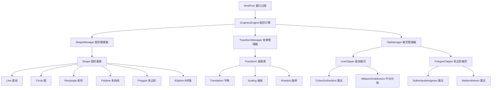
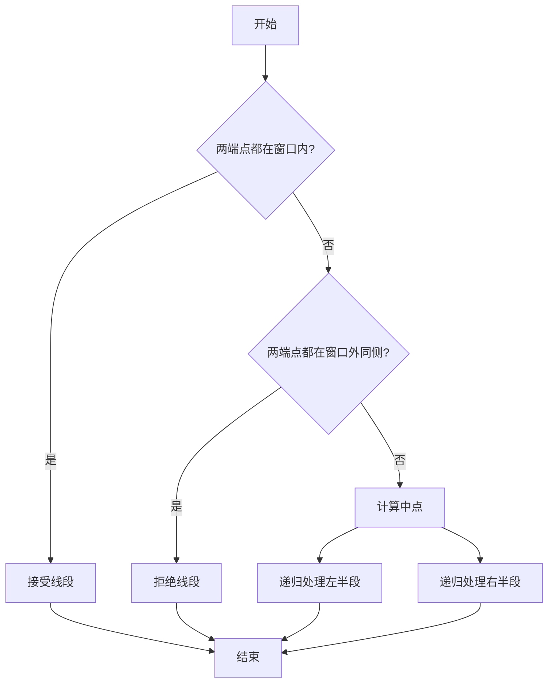
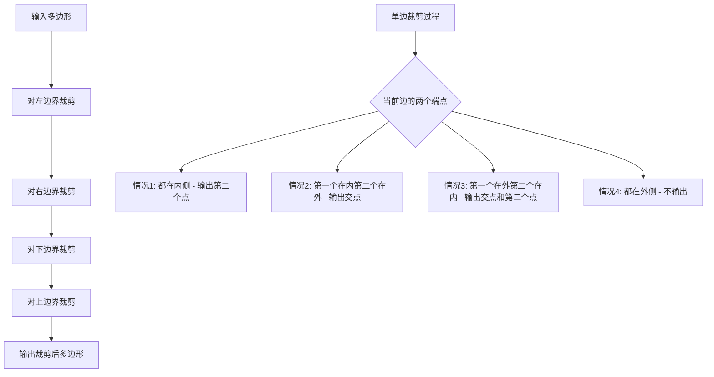
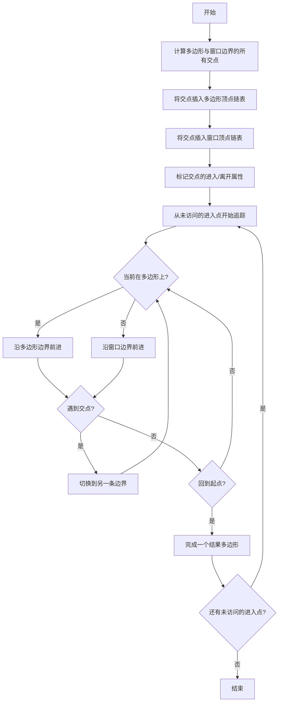

# 设计文档 - 几何变换与裁剪

## 概述

本设计文档描述了实验三"基本图形变换和裁剪"的技术实现方案。该系统在现有的 GraphicsEngine 架构基础上扩展，添加图形对象管理、几何变换和多种裁剪算法。

### 设计目标

1. **可扩展性**：在现有代码基础上最小化修改，通过添加新类和方法实现功能
2. **模块化**：将图形对象、变换操作和裁剪算法分离为独立模块
3. **性能**：使用高效的数据结构和算法，确保实时交互体验
4. **可维护性**：清晰的代码结构和完善的注释

### 技术栈

- **语言**：C++
- **图形API**：Windows GDI
- **开发环境**：Visual Studio
- **架构模式**：面向对象设计

## 架构设计

### 系统架构图



### 核心组件

#### 1. Shape 图形对象系统

**设计理念**：使用面向对象的继承体系，所有图形类型继承自基类 `Shape`

```cpp
// 图形基类
class Shape {
protected:
    std::vector<Point2D> points;  // 图形的关键点
    COLORREF color;
    bool selected;
    ShapeType type;
    
public:
    virtual void Draw(HDC hdc) = 0;
    virtual void Transform(const Matrix3x3& matrix) = 0;
    virtual bool HitTest(Point2D point, int tolerance = 5) = 0;
    virtual Shape* Clone() const = 0;
    virtual ~Shape() {}
    
    // Getters and setters
    bool IsSelected() const { return selected; }
    void SetSelected(bool sel) { selected = sel; }
    ShapeType GetType() const { return type; }
    const std::vector<Point2D>& GetPoints() const { return points; }
};
```

**派生类**：
- `LineShape`：直线（2个端点）
- `CircleShape`：圆（中心点 + 半径）
- `RectangleShape`：矩形（2个对角点）
- `PolylineShape`：多段线（多个顶点）
- `PolygonShape`：多边形（多个顶点，自动闭合）
- `BSplineShape`：B样条曲线（控制点）

#### 2. ShapeManager 图形管理器

**职责**：管理所有图形对象的生命周期、选择状态和渲染

```cpp
class ShapeManager {
private:
    std::vector<std::unique_ptr<Shape>> shapes;
    Shape* selectedShape;
    
public:
    void AddShape(std::unique_ptr<Shape> shape);
    void RemoveShape(Shape* shape);
    void ClearAll();
    
    Shape* SelectShape(Point2D point);
    void DeselectAll();
    Shape* GetSelectedShape() const { return selectedShape; }
    
    void DrawAll(HDC hdc);
    void DrawSelection(HDC hdc, Shape* shape);
    
    const std::vector<std::unique_ptr<Shape>>& GetShapes() const;
};
```

**选择算法**：
- 对于直线：计算点到线段的距离，小于阈值则选中
- 对于圆：检查点是否在圆环内（半径 ± 阈值）
- 对于多边形：使用射线法判断点是否在多边形内部或边界上

#### 3. Transform 变换系统

**数学基础**：使用齐次坐标和 3x3 变换矩阵

```cpp
// 3x3 矩阵类
class Matrix3x3 {
private:
    float m[3][3];
    
public:
    Matrix3x3();  // 单位矩阵
    static Matrix3x3 Translation(float tx, float ty);
    static Matrix3x3 Scaling(float sx, float sy, Point2D center);
    static Matrix3x3 Rotation(float angle, Point2D center);
    
    Matrix3x3 operator*(const Matrix3x3& other) const;
    Point2D Transform(const Point2D& point) const;
};
```

**变换管理器**：

```cpp
class TransformManager {
private:
    ShapeManager* shapeManager;
    TransformMode currentMode;
    Point2D anchorPoint;      // 变换锚点
    Point2D startPoint;       // 操作起始点
    bool isTransforming;
    
public:
    void SetMode(TransformMode mode);
    void BeginTransform(Point2D point);
    void UpdateTransform(Point2D point);
    void EndTransform();
    
    void ApplyTranslation(Shape* shape, float dx, float dy);
    void ApplyScaling(Shape* shape, float scale, Point2D center);
    void ApplyRotation(Shape* shape, float angle, Point2D center);
};
```

**变换实现细节**：

1. **平移**：
   - 用户点击确定起点，拖动鼠标到终点
   - 计算位移向量 (dx, dy)
   - 对图形所有顶点应用平移矩阵

2. **缩放**：
   - 默认以图形中心为缩放中心
   - 用户拖动鼠标，距离变化决定缩放比例
   - 缩放比例 = 当前距离 / 初始距离

3. **旋转**：
   - 用户点击确定旋转中心
   - 拖动鼠标，计算相对于中心的角度变化
   - 角度 = atan2(y2-cy, x2-cx) - atan2(y1-cy, x1-cx)

#### 4. ClipManager 裁剪系统

**裁剪管理器**：

```cpp
class ClipManager {
private:
    ShapeManager* shapeManager;
    ClipMode currentMode;
    Rectangle clipWindow;
    bool isDefiningWindow;
    Point2D windowStart;
    
public:
    void SetMode(ClipMode mode);
    void BeginDefineWindow(Point2D point);
    void UpdateWindow(Point2D point);
    void EndDefineWindow(Point2D point);
    
    void ExecuteClipping();
    
private:
    void ClipLinesCohenSutherland();
    void ClipLinesMidpointSubdivision();
    void ClipPolygonsSutherlandHodgman();
    void ClipPolygonsWeilerAtherton();
};
```

## 裁剪算法详细设计

### 1. Cohen-Sutherland 直线裁剪算法

**原理**：使用区域编码快速判断线段与裁剪窗口的关系

**区域编码**：
```
1001 | 1000 | 1010
-----|------|-----
0001 | 0000 | 0010
-----|------|-----
0101 | 0100 | 0110
```

**算法流程**：

```mermaid
graph TD
    A[开始] --> B[计算端点编码 code1, code2]
    B --> C{code1 | code2 == 0?}
    C -->|是| D[完全在窗口内，接受]
    C -->|否| E{code1 & code2 != 0?}
    E -->|是| F[完全在窗口外，拒绝]
    E -->|否| G[部分在窗口内]
    G --> H[选择窗口外的端点]
    H --> I[计算与窗口边界交点]
    I --> J[用交点替换窗口外端点]
    J --> B
    D --> K[结束]
    F --> K
```

**实现代码结构**：

```cpp
class CohenSutherlandClipper {
private:
    enum OutCode {
        INSIDE = 0,  // 0000
        LEFT = 1,    // 0001
        RIGHT = 2,   // 0010
        BOTTOM = 4,  // 0100
        TOP = 8      // 1000
    };
    
    int ComputeOutCode(Point2D point, Rectangle window);
    bool ClipLine(Point2D& p1, Point2D& p2, Rectangle window);
    
public:
    std::vector<LineShape*> Clip(const std::vector<LineShape*>& lines, 
                                  Rectangle window);
};
```

### 2. 中点分割直线裁剪算法

**原理**：递归地将线段分割为两半，直到可以判断接受或拒绝

**算法流程**：



**实现代码结构**：

```cpp
class MidpointSubdivisionClipper {
private:
    bool IsInside(Point2D point, Rectangle window);
    bool IsOutsideSameSide(Point2D p1, Point2D p2, Rectangle window);
    void ClipLineRecursive(Point2D p1, Point2D p2, Rectangle window,
                          std::vector<std::pair<Point2D, Point2D>>& result,
                          int depth = 0);
    
public:
    std::vector<LineShape*> Clip(const std::vector<LineShape*>& lines,
                                  Rectangle window);
};
```

### 3. Sutherland-Hodgman 多边形裁剪算法

**原理**：依次对裁剪窗口的四条边进行裁剪，每次裁剪产生新的多边形

**算法流程**：



**实现代码结构**：

```cpp
class SutherlandHodgmanClipper {
private:
    enum EdgeType { LEFT, RIGHT, BOTTOM, TOP };
    
    bool IsInside(Point2D point, EdgeType edge, Rectangle window);
    Point2D ComputeIntersection(Point2D p1, Point2D p2, 
                                EdgeType edge, Rectangle window);
    std::vector<Point2D> ClipAgainstEdge(const std::vector<Point2D>& polygon,
                                         EdgeType edge, Rectangle window);
    
public:
    std::vector<PolygonShape*> Clip(const std::vector<PolygonShape*>& polygons,
                                     Rectangle window);
};
```

### 4. Weiler-Atherton 多边形裁剪算法

**原理**：构建多边形和裁剪窗口的交点链表，通过追踪边界生成结果多边形

**算法流程**：



**实现代码结构**：

```cpp
class WeilerAthertonClipper {
private:
    struct Vertex {
        Point2D point;
        bool isIntersection;
        bool isEntry;  // 进入点还是离开点
        Vertex* next;
        Vertex* neighbor;  // 对应的另一条链表上的交点
        bool visited;
    };
    
    std::vector<Vertex*> FindIntersections(const std::vector<Point2D>& polygon,
                                           Rectangle window);
    void BuildVertexLists(const std::vector<Point2D>& polygon,
                         Rectangle window,
                         std::vector<Vertex*>& polyList,
                         std::vector<Vertex*>& windowList);
    void MarkEntryExit(std::vector<Vertex*>& polyList, Rectangle window);
    std::vector<std::vector<Point2D>> TracePolygons(std::vector<Vertex*>& polyList);
    
public:
    std::vector<PolygonShape*> Clip(const std::vector<PolygonShape*>& polygons,
                                     Rectangle window);
};
```

## 数据模型

### 核心数据结构

```cpp
// 点结构（已存在，保持不变）
struct Point2D {
    int x, y;
    Point2D(int x = 0, int y = 0) : x(x), y(y) {}
};

// 矩形结构
struct Rectangle {
    int xmin, ymin, xmax, ymax;
    Rectangle(int x1 = 0, int y1 = 0, int x2 = 0, int y2 = 0) {
        xmin = std::min(x1, x2);
        ymin = std::min(y1, y2);
        xmax = std::max(x1, x2);
        ymax = std::max(y1, y2);
    }
    bool Contains(Point2D point) const;
};

// 图形类型枚举
enum ShapeType {
    SHAPE_LINE,
    SHAPE_CIRCLE,
    SHAPE_RECTANGLE,
    SHAPE_POLYLINE,
    SHAPE_POLYGON,
    SHAPE_BSPLINE
};

// 绘图模式扩展
enum DrawMode {
    // 现有模式...
    MODE_POLYGON,              // 多边形绘制
    MODE_SELECT,               // 选择模式
    MODE_TRANSLATE,            // 平移模式
    MODE_SCALE,                // 缩放模式
    MODE_ROTATE,               // 旋转模式
    MODE_CLIP_COHEN_SUTHERLAND,      // Cohen-Sutherland裁剪
    MODE_CLIP_MIDPOINT,               // 中点分割裁剪
    MODE_CLIP_SUTHERLAND_HODGMAN,    // Sutherland-Hodgman裁剪
    MODE_CLIP_WEILER_ATHERTON         // Weiler-Atherton裁剪
};
```

### GraphicsEngine 类扩展

```cpp
class GraphicsEngine {
private:
    // 现有成员...
    std::unique_ptr<ShapeManager> shapeManager;
    std::unique_ptr<TransformManager> transformManager;
    std::unique_ptr<ClipManager> clipManager;
    
    // 临时绘制状态
    std::unique_ptr<Shape> previewShape;
    Rectangle previewClipWindow;
    
public:
    // 现有方法...
    
    // 新增方法
    void DrawPolygon(const std::vector<Point2D>& points);
    void SelectShape(int x, int y);
    void BeginTransform(int x, int y);
    void UpdateTransform(int x, int y);
    void EndTransform(int x, int y);
    void BeginClipping(int x, int y);
    void UpdateClipping(int x, int y);
    void EndClipping(int x, int y);
    
    void RenderAll();
    void RenderPreview();
};
```

## 用户界面设计

### 菜单结构

```
文件(F)
├── 新建(N)         Ctrl+N
└── 退出(X)

实验(E)
├── 实验一：基本图形绘制
├── 实验二：图形生成算法
└── 实验三：变换与裁剪

绘图(D)
├── 直线（DDA算法）
├── 直线（Bresenham算法）
├── 圆（中点算法）
├── 圆（Bresenham算法）
├── 矩形
├── 多段线（右键结束）
├── 多边形（右键结束）        [新增]
└── B样条曲线

填充(I)
├── 扫描线填充
└── 边界填充

变换(T)                        [新增菜单]
├── 选择图形
├── 平移
├── 缩放
└── 旋转

裁剪(C)                        [新增菜单]
├── 直线裁剪
│   ├── Cohen-Sutherland算法
│   └── 中点分割算法
└── 多边形裁剪
    ├── Sutherland-Hodgman算法
    └── Weiler-Atherton算法

帮助(H)
└── 关于(A)
```

### 交互流程

#### 多边形绘制流程
1. 用户点击"多边形"菜单
2. 在画布上点击鼠标左键添加顶点
3. 移动鼠标时显示预览线
4. 点击右键或双击完成绘制，自动闭合多边形

#### 图形变换流程
1. 用户点击"选择图形"菜单
2. 点击画布上的图形，被选中的图形高亮显示
3. 点击变换菜单（平移/缩放/旋转）
4. 根据鼠标操作实时预览变换效果
5. 释放鼠标完成变换

#### 裁剪操作流程
1. 用户点击裁剪算法菜单
2. 在画布上拖动鼠标定义裁剪矩形（虚线框预览）
3. 释放鼠标后自动执行裁剪
4. 显示裁剪结果

### 视觉反馈

- **选中图形**：使用虚线边框和控制点标记
- **预览效果**：使用半透明或虚线显示
- **裁剪窗口**：使用红色虚线矩形
- **状态提示**：在窗口标题栏显示当前模式

## 错误处理

### 异常情况处理

1. **无效操作**：
   - 未选中图形时尝试变换 → 提示"请先选择图形"
   - 裁剪窗口过小 → 提示"裁剪区域无效"

2. **数据验证**：
   - 多边形顶点少于3个 → 提示"多边形至少需要3个顶点"
   - 变换参数异常 → 限制在合理范围内

3. **性能保护**：
   - 图形对象过多 → 限制最大数量或优化渲染
   - 裁剪算法递归深度 → 设置最大深度防止栈溢出

## 测试策略

### 单元测试

1. **变换矩阵测试**：
   - 测试平移、缩放、旋转矩阵的正确性
   - 测试矩阵乘法和点变换

2. **裁剪算法测试**：
   - 测试各种线段位置（完全内部、完全外部、部分相交）
   - 测试多边形裁剪的边界情况

3. **图形选择测试**：
   - 测试点击检测的准确性
   - 测试重叠图形的选择优先级

### 集成测试

1. **完整工作流测试**：
   - 绘制 → 选择 → 变换 → 裁剪
   - 多次操作的累积效果

2. **边界条件测试**：
   - 极大/极小的图形
   - 退化情况（零长度线段、零面积多边形）

### 用户验收测试

1. **功能完整性**：验证所有需求是否实现
2. **交互体验**：操作是否流畅、反馈是否及时
3. **视觉效果**：渲染是否正确、美观

## 性能优化

### 渲染优化

1. **双缓冲**：使用内存DC避免闪烁
2. **脏矩形**：只重绘变化的区域
3. **图形剔除**：不绘制视口外的图形

### 算法优化

1. **空间索引**：使用四叉树加速图形选择
2. **早期退出**：在裁剪算法中尽早判断接受/拒绝
3. **浮点优化**：使用整数运算替代浮点运算（在可能的情况下）

## 扩展性考虑

### 未来可能的扩展

1. **撤销/重做功能**：使用命令模式保存操作历史
2. **图形组合**：支持多个图形的组合和解组
3. **更多变换**：错切、镜像等
4. **更多裁剪算法**：Liang-Barsky算法等
5. **文件保存/加载**：序列化图形对象到文件

### 设计模式应用

1. **工厂模式**：创建不同类型的图形对象
2. **策略模式**：切换不同的裁剪算法
3. **观察者模式**：图形状态变化通知
4. **命令模式**：实现撤销/重做

## 实现优先级

### 第一阶段：基础架构
1. Shape 类层次结构
2. ShapeManager 图形管理
3. 多边形绘制功能

### 第二阶段：变换功能
1. 图形选择机制
2. 变换矩阵类
3. 平移、缩放、旋转实现

### 第三阶段：裁剪功能
1. 裁剪窗口定义
2. Cohen-Sutherland 直线裁剪
3. 中点分割直线裁剪
4. Sutherland-Hodgman 多边形裁剪
5. Weiler-Atherton 多边形裁剪

### 第四阶段：优化和完善
1. 用户界面优化
2. 错误处理完善
3. 性能优化
4. 文档和注释
