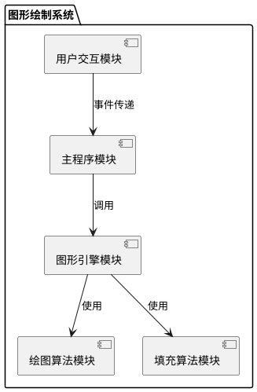
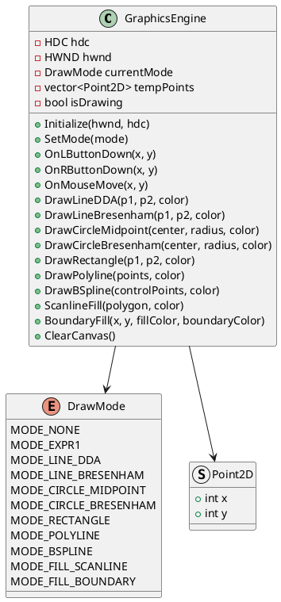
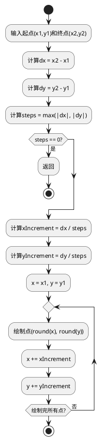
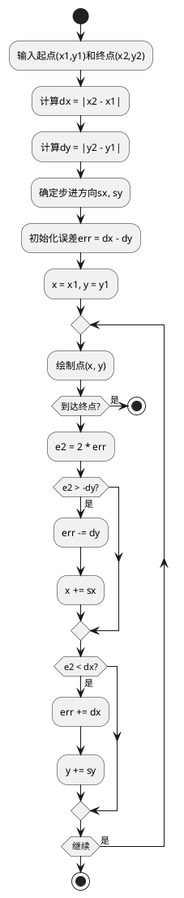
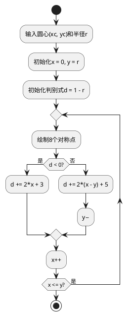
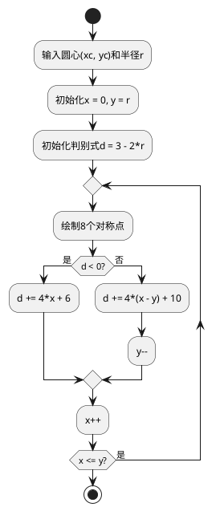
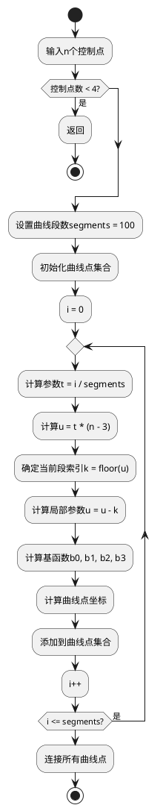
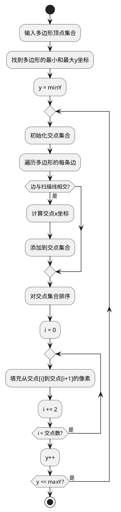
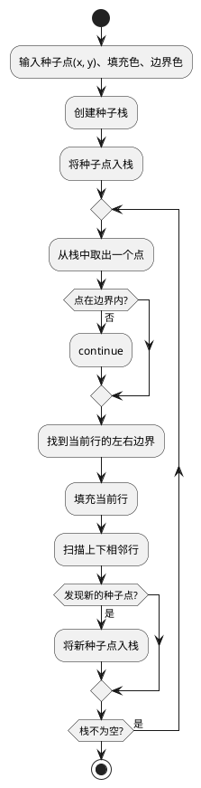

# 计算机图形学综合实验报告

**学号：** 2023112573  
**姓名：** 张春冉  
**学校：** 西南交通大学  
**学院：** 计算机与人工智能学院  
**班级：** 软件工程2023-02班

---

## 一、实验目的

1. 掌握计算机图形学中基本图形的生成算法，包括直线、圆、曲线等的绘制方法
2. 理解并实现DDA算法、Bresenham算法、中点算法等经典图形生成算法
3. 掌握图形填充算法，包括扫描线填充和边界填充的原理与实现
4. 学习B样条曲线的数学原理和绘制方法
5. 提高Windows图形编程能力，熟悉GDI图形接口的使用
6. 培养软件工程思维，设计并实现一个完整的图形绘制系统

---

## 二、实验任务及要求

### 2.1 基本要求

1. **基本图形绘制**：实现直线、曲线、圆、矩形、多段线等基本图形的绘制，参数通过鼠标输入
2. **直线算法**：分别采用DDA算法和Bresenham算法实现直线段的绘制
3. **圆绘制算法**：分别采用中点算法和Bresenham算法实现圆的绘制
4. **区域填充**：采用扫描线法和边界填充法实现封闭区域的填充
5. **B样条曲线**：通过多个控制点绘制连续的B样条曲线

### 2.2 技术要求

- 使用C++语言和Windows API开发
- 提供友好的图形用户界面
- 支持菜单操作和鼠标交互
- 代码结构清晰，注释完整

---

## 三、界面设计及交互方式

### 3.1 主界面设计

程序采用Windows桌面应用程序架构，主窗口包含菜单栏和绘图区域。

**窗口标题：** 计算机图形学实验 - 2023112573 张春冉 - 西南交通大学 软件工程2023-02班

### 3.2 菜单结构

```
文件(F)
├── 新建(N)     Ctrl+N
├── ──────────
└── 退出(X)

实验(E)
└── 实验一：基本图形绘制

绘图(D)
├── 直线（DDA算法）
├── 直线（Bresenham算法）
├── ──────────
├── 圆（中点算法）
├── 圆（Bresenham算法）
├── ──────────
├── 矩形
├── 多段线（右键结束）
└── B样条曲线（4个控制点）

填充(I)
├── 扫描线填充（右键结束）
└── 边界填充

帮助(H)
└── 关于(A)
```

### 3.3 交互方式设计

#### 3.3.1 直线绘制
1. 点击菜单选择算法（DDA或Bresenham）
2. 在画布上点击鼠标左键确定起点
3. 移动鼠标到终点位置
4. 再次点击鼠标左键确定终点，完成绘制

#### 3.3.2 圆的绘制
1. 点击菜单选择算法（中点或Bresenham）
2. 在画布上点击鼠标左键确定圆心
3. 移动鼠标确定半径
4. 再次点击鼠标左键，完成圆的绘制

#### 3.3.3 矩形绘制
1. 点击"矩形"菜单项
2. 点击鼠标左键确定矩形的一个顶点
3. 移动鼠标到对角顶点
4. 再次点击鼠标左键，完成矩形绘制

#### 3.3.4 多段线绘制
1. 点击"多段线"菜单项
2. 依次点击鼠标左键添加顶点
3. 点击鼠标右键结束绘制

#### 3.3.5 B样条曲线绘制
1. 点击"B样条曲线"菜单项
2. 依次点击4个或更多控制点
3. 程序自动绘制平滑的B样条曲线

#### 3.3.6 扫描线填充
1. 点击"扫描线填充"菜单项
2. 依次点击鼠标左键定义多边形顶点（至少3个）
3. 点击鼠标右键结束，程序自动填充多边形

#### 3.3.7 边界填充
1. 先绘制一个封闭图形（如圆、矩形等）
2. 点击"边界填充"菜单项
3. 在封闭图形内部点击鼠标左键，程序自动填充

---

## 四、功能模块结构及说明

### 4.1 系统架构图



### 4.2 类结构图



### 4.3 功能模块说明

#### 4.3.1 主程序模块（ComputerGraphics.cpp）
- **功能**：程序入口，窗口创建，消息循环处理
- **职责**：
  - 创建主窗口和菜单
  - 处理Windows消息（WM_CREATE, WM_PAINT, WM_COMMAND等）
  - 响应菜单点击事件
  - 处理鼠标事件并转发给图形引擎

#### 4.3.2 图形引擎模块（GraphicsEngine类）
- **功能**：核心绘图引擎，管理绘图状态和调度算法
- **职责**：
  - 维护当前绘图模式
  - 管理临时点集合
  - 处理鼠标输入并转换为图形参数
  - 调用相应的绘图算法
  - 管理设备上下文（HDC）

#### 4.3.3 绘图算法模块
包含以下子模块：

**直线绘制模块**
- `DrawLineDDA()`: DDA算法实现
- `DrawLineBresenham()`: Bresenham算法实现

**圆绘制模块**
- `DrawCircleMidpoint()`: 中点圆算法实现
- `DrawCircleBresenham()`: Bresenham圆算法实现

**基本图形模块**
- `DrawRectangle()`: 矩形绘制
- `DrawPolyline()`: 多段线绘制
- `DrawBSpline()`: B样条曲线绘制

#### 4.3.4 填充算法模块
- `ScanlineFill()`: 扫描线填充算法
- `BoundaryFill()`: 边界填充算法（种子填充）

#### 4.3.5 用户交互模块
- 鼠标事件处理（OnLButtonDown, OnRButtonDown, OnMouseMove）
- 菜单命令处理
- 模式切换管理

---

## 五、算法流程图及说明

### 5.1 DDA直线算法



**算法说明：**
- DDA（Digital Differential Analyzer）算法是一种增量算法
- 通过计算每步的增量来逐点绘制直线
- 优点：简单直观，易于理解
- 缺点：涉及浮点运算，速度较慢

### 5.2 Bresenham直线算法



**算法说明：**
- Bresenham算法只使用整数运算，效率高
- 通过误差累积判断下一个点的位置
- 优点：速度快，精度高
- 应用：广泛用于图形硬件和软件

### 5.3 中点圆算法



**算法说明：**
- 利用圆的8对称性，只需计算1/8圆弧
- 通过判别式决定下一个点的位置
- 只使用整数加法运算，效率高

### 5.4 Bresenham圆算法



**算法说明：**
- 与中点圆算法类似，但判别式计算方式不同
- 同样利用圆的8对称性
- 整数运算，效率高

### 5.5 B样条曲线算法



**算法说明：**
- B样条曲线是一种参数曲线
- 通过控制点和基函数计算曲线上的点
- 具有局部控制性，修改一个控制点只影响局部曲线
- 曲线不一定经过控制点

### 5.6 扫描线填充算法



**算法说明：**
- 从下到上逐行扫描多边形
- 计算扫描线与多边形边的交点
- 交点两两配对，填充之间的像素
- 适用于任意多边形的填充

### 5.7 边界填充算法（种子填充）



**算法说明：**
- 从种子点开始向四周扩散填充
- 使用栈避免递归导致的栈溢出
- 采用扫描线优化，提高填充效率
- 遇到边界色停止扩散

---

## 六、核心代码及注释

### 6.1 DDA直线算法实现

```cpp
void GraphicsEngine::DrawLineDDA(Point2D p1, Point2D p2, COLORREF color)
{
    // 计算x和y方向的增量
    int dx = p2.x - p1.x;
    int dy = p2.y - p1.y;
    
    // 确定步数：取dx和dy中的较大值
    int steps = abs(dx) > abs(dy) ? abs(dx) : abs(dy);
    
    if (steps == 0) return;  // 起点和终点重合
    
    // 计算每步的增量
    float xIncrement = (float)dx / steps;
    float yIncrement = (float)dy / steps;
    
    // 初始化当前点为起点
    float x = (float)p1.x;
    float y = (float)p1.y;
    
    // 逐步绘制直线上的点
    for (int i = 0; i <= steps; i++)
    {
        // 四舍五入并绘制点
        SetPixel((int)(x + 0.5), (int)(y + 0.5), color);
        x += xIncrement;  // x坐标递增
        y += yIncrement;  // y坐标递增
    }
}
```

### 6.2 Bresenham直线算法实现

```cpp
void GraphicsEngine::DrawLineBresenham(Point2D p1, Point2D p2, COLORREF color)
{
    // 计算x和y方向的绝对增量
    int dx = abs(p2.x - p1.x);
    int dy = abs(p2.y - p1.y);
    
    // 确定步进方向（1或-1）
    int sx = p1.x < p2.x ? 1 : -1;
    int sy = p1.y < p2.y ? 1 : -1;
    
    // 初始化误差项
    int err = dx - dy;
    
    int x = p1.x;
    int y = p1.y;
    
    while (true)
    {
        SetPixel(x, y, color);  // 绘制当前点
        
        if (x == p2.x && y == p2.y) break;  // 到达终点
        
        int e2 = 2 * err;  // 误差的两倍
        
        // 根据误差决定下一步的方向
        if (e2 > -dy)
        {
            err -= dy;
            x += sx;  // x方向步进
        }
        if (e2 < dx)
        {
            err += dx;
            y += sy;  // y方向步进
        }
    }
}
```

### 6.3 中点圆算法实现

```cpp
void GraphicsEngine::DrawCircleMidpoint(Point2D center, int radius, COLORREF color)
{
    int x = 0;
    int y = radius;
    int d = 1 - radius;  // 初始判别式
    
    while (x <= y)
    {
        // 利用圆的8对称性绘制8个点
        SetPixel(center.x + x, center.y + y, color);
        SetPixel(center.x - x, center.y + y, color);
        SetPixel(center.x + x, center.y - y, color);
        SetPixel(center.x - x, center.y - y, color);
        SetPixel(center.x + y, center.y + x, color);
        SetPixel(center.x - y, center.y + x, color);
        SetPixel(center.x + y, center.y - x, color);
        SetPixel(center.x - y, center.y - x, color);
        
        // 根据判别式更新下一个点
        if (d < 0)
        {
            d += 2 * x + 3;  // 选择右边的点
        }
        else
        {
            d += 2 * (x - y) + 5;  // 选择右下方的点
            y--;
        }
        x++;
    }
}
```

### 6.4 Bresenham圆算法实现

```cpp
void GraphicsEngine::DrawCircleBresenham(Point2D center, int radius, COLORREF color)
{
    int x = 0;
    int y = radius;
    int d = 3 - 2 * radius;  // 初始判别式
    
    while (x <= y)
    {
        // 利用圆的8对称性绘制8个点
        SetPixel(center.x + x, center.y + y, color);
        SetPixel(center.x - x, center.y + y, color);
        SetPixel(center.x + x, center.y - y, color);
        SetPixel(center.x - x, center.y - y, color);
        SetPixel(center.x + y, center.y + x, color);
        SetPixel(center.x - y, center.y + x, color);
        SetPixel(center.x + y, center.y - x, color);
        SetPixel(center.x - y, center.y - x, color);
        
        // 根据判别式更新下一个点
        if (d < 0)
        {
            d += 4 * x + 6;
        }
        else
        {
            d += 4 * (x - y) + 10;
            y--;
        }
        x++;
    }
}
```

### 6.5 B样条曲线实现

```cpp
void GraphicsEngine::DrawBSpline(const std::vector<Point2D>& controlPoints, COLORREF color)
{
    if (controlPoints.size() < 4) return;  // 至少需要4个控制点
    
    const int segments = 100;  // 曲线分段数
    std::vector<Point2D> curvePoints;
    
    // 计算曲线上的点
    for (int i = 0; i <= segments; i++)
    {
        float t = (float)i / segments;  // 参数t从0到1
        Point2D point = CalculateBSplinePoint(t, controlPoints);
        curvePoints.push_back(point);
    }
    
    // 连接所有曲线点
    DrawPolyline(curvePoints, color);
}

Point2D GraphicsEngine::CalculateBSplinePoint(float t, const std::vector<Point2D>& controlPoints)
{
    int n = static_cast<int>(controlPoints.size());
    if (n < 4) return Point2D(0, 0);
    
    // 计算当前参数对应的曲线段
    float u = t * (n - 3);
    int k = (int)u;
    if (k >= n - 3) k = n - 4;
    u = u - k;  // 局部参数
    
    // 计算B样条基函数
    float b0 = (1 - u) * (1 - u) * (1 - u) / 6;
    float b1 = (3 * u * u * u - 6 * u * u + 4) / 6;
    float b2 = (-3 * u * u * u + 3 * u * u + 3 * u + 1) / 6;
    float b3 = u * u * u / 6;
    
    // 计算曲线点坐标
    Point2D result;
    result.x = (int)(b0 * controlPoints[k].x + b1 * controlPoints[k+1].x + 
                     b2 * controlPoints[k+2].x + b3 * controlPoints[k+3].x);
    result.y = (int)(b0 * controlPoints[k].y + b1 * controlPoints[k+1].y + 
                     b2 * controlPoints[k+2].y + b3 * controlPoints[k+3].y);
    
    return result;
}
```

### 6.6 扫描线填充算法实现

```cpp
void GraphicsEngine::ScanlineFill(const std::vector<Point2D>& polygon, COLORREF fillColor)
{
    if (polygon.size() < 3) return;  // 至少需要3个顶点
    
    // 找到多边形的y坐标范围
    int minY = polygon[0].y, maxY = polygon[0].y;
    for (size_t i = 0; i < polygon.size(); i++) {
        if (polygon[i].y < minY) minY = polygon[i].y;
        if (polygon[i].y > maxY) maxY = polygon[i].y;
    }
    
    // 创建画笔以提高绘制效率
    HPEN hPen = CreatePen(PS_SOLID, 1, fillColor);
    HPEN hOldPen = (HPEN)SelectObject(hdc, hPen);
    
    // 对每条扫描线进行处理
    for (int y = minY; y <= maxY; y++) {
        std::vector<int> intersections;  // 存储交点的x坐标
        
        // 计算扫描线与多边形各边的交点
        for (size_t i = 0; i < polygon.size(); i++) {
            Point2D p1 = polygon[i];
            Point2D p2 = polygon[(i + 1) % polygon.size()];  // 下一个顶点
            
            // 判断边是否与扫描线相交
            if ((p1.y <= y && p2.y > y) || (p2.y <= y && p1.y > y)) {
                // 计算交点的x坐标
                int x = p1.x + (y - p1.y) * (p2.x - p1.x) / (p2.y - p1.y);
                intersections.push_back(x);
            }
        }
        
        // 对交点按x坐标排序（冒泡排序）
        for (size_t i = 0; i < intersections.size(); i++) {
            for (size_t j = i + 1; j < intersections.size(); j++) {
                if (intersections[i] > intersections[j]) {
                    int temp = intersections[i];
                    intersections[i] = intersections[j];
                    intersections[j] = temp;
                }
            }
        }
        
        // 填充交点之间的像素（使用LineTo提高效率）
        for (size_t i = 0; i + 1 < intersections.size(); i += 2) {
            MoveToEx(hdc, intersections[i], y, NULL);
            LineTo(hdc, intersections[i + 1], y);
        }
    }
    
    // 恢复原画笔
    SelectObject(hdc, hOldPen);
    DeleteObject(hPen);
}
```

### 6.7 边界填充算法实现

```cpp
void GraphicsEngine::BoundaryFill(int x, int y, COLORREF fillColor, COLORREF boundaryColor)
{
    RECT clientRect;
    GetClientRect(hwnd, &clientRect);
    
    // 检查起始点颜色
    COLORREF startColor = GetPixel(x, y);
    if (startColor == boundaryColor || startColor == fillColor) {
        return;  // 起始点在边界上或已填充
    }
    
    // 使用栈实现非递归填充
    std::stack<Point2D> seedStack;
    seedStack.push(Point2D(x, y));
    
    int maxIterations = 100000;  // 限制迭代次数防止卡死
    int iterations = 0;
    
    // 创建画笔提高绘制效率
    HPEN hPen = CreatePen(PS_SOLID, 1, fillColor);
    HPEN hOldPen = (HPEN)SelectObject(hdc, hPen);
    
    while (!seedStack.empty() && iterations < maxIterations) {
        Point2D seed = seedStack.top();
        seedStack.pop();
        iterations++;
        
        // 边界检查
        if (seed.x < 0 || seed.x >= clientRect.right || 
            seed.y < 0 || seed.y >= clientRect.bottom) {
            continue;
        }
        
        COLORREF c = GetPixel(seed.x, seed.y);
        if (c == boundaryColor || c == fillColor) {
            continue;  // 遇到边界或已填充区域
        }
        
        // 找到当前扫描线的左右边界
        int left = seed.x;
        int right = seed.x;
        
        // 向左扩展
        while (left > 0) {
            c = GetPixel(left - 1, seed.y);
            if (c == boundaryColor || c == fillColor) break;
            left--;
        }
        
        // 向右扩展
        while (right < clientRect.right - 1) {
            c = GetPixel(right + 1, seed.y);
            if (c == boundaryColor || c == fillColor) break;
            right++;
        }
        
        // 填充当前扫描线
        MoveToEx(hdc, left, seed.y, NULL);
        LineTo(hdc, right + 1, seed.y);
        
        // 检查上下相邻扫描线，添加新的种子点
        bool inSpan = false;
        for (int i = left; i <= right; i++) {
            // 检查上方扫描线
            if (seed.y > 0) {
                c = GetPixel(i, seed.y - 1);
                if (c != boundaryColor && c != fillColor) {
                    if (!inSpan) {
                        seedStack.push(Point2D(i, seed.y - 1));
                        inSpan = true;
                    }
                } else {
                    inSpan = false;
                }
            }
        }
        
        inSpan = false;
        for (int i = left; i <= right; i++) {
            // 检查下方扫描线
            if (seed.y < clientRect.bottom - 1) {
                c = GetPixel(i, seed.y + 1);
                if (c != boundaryColor && c != fillColor) {
                    if (!inSpan) {
                        seedStack.push(Point2D(i, seed.y + 1));
                        inSpan = true;
                    }
                } else {
                    inSpan = false;
                }
            }
        }
    }
    
    // 恢复画笔
    SelectObject(hdc, hOldPen);
    DeleteObject(hPen);
    
    // 超过迭代限制时提示用户
    if (iterations >= maxIterations) {
        MessageBox(hwnd, L"填充区域过大，已停止填充", L"提示", MB_OK | MB_ICONWARNING);
    }
}
```

### 6.8 鼠标事件处理

```cpp
void GraphicsEngine::OnLButtonDown(int x, int y)
{
    Point2D clickPoint(x, y);
    
    switch (currentMode)
    {
    case MODE_LINE_DDA:
    case MODE_LINE_BRESENHAM:
        if (!isDrawing)
        {
            // 第一次点击：记录起点
            tempPoints.clear();
            tempPoints.push_back(clickPoint);
            isDrawing = true;
        }
        else
        {
            // 第二次点击：记录终点并绘制
            tempPoints.push_back(clickPoint);
            if (currentMode == MODE_LINE_DDA)
                DrawLineDDA(tempPoints[0], tempPoints[1]);
            else
                DrawLineBresenham(tempPoints[0], tempPoints[1]);
            isDrawing = false;
        }
        break;
        
    case MODE_CIRCLE_MIDPOINT:
    case MODE_CIRCLE_BRESENHAM:
        if (!isDrawing)
        {
            // 第一次点击：记录圆心
            tempPoints.clear();
            tempPoints.push_back(clickPoint);
            isDrawing = true;
        }
        else
        {
            // 第二次点击：计算半径并绘制
            tempPoints.push_back(clickPoint);
            int radius = (int)sqrt(pow(tempPoints[1].x - tempPoints[0].x, 2) + 
                                 pow(tempPoints[1].y - tempPoints[0].y, 2));
            if (currentMode == MODE_CIRCLE_MIDPOINT)
                DrawCircleMidpoint(tempPoints[0], radius);
            else
                DrawCircleBresenham(tempPoints[0], radius);
            isDrawing = false;
        }
        break;
        
    case MODE_POLYLINE:
        // 多段线：每次点击添加一个顶点
        tempPoints.push_back(clickPoint);
        if (!isDrawing) isDrawing = true;
        break;
        
    case MODE_BSPLINE:
        // B样条：收集控制点
        tempPoints.push_back(clickPoint);
        if (!isDrawing) isDrawing = true;
        if (tempPoints.size() >= 4)
        {
            // 达到4个控制点，绘制曲线
            DrawBSpline(tempPoints);
            tempPoints.clear();
            isDrawing = false;
        }
        break;
        
    case MODE_FILL_SCANLINE:
        // 扫描线填充：收集多边形顶点
        tempPoints.push_back(clickPoint);
        if (!isDrawing) isDrawing = true;
        if (tempPoints.size() >= 3)
        {
            // 实时显示多边形轮廓
            DrawPolyline(tempPoints, RGB(0, 0, 0));
        }
        break;
        
    case MODE_FILL_BOUNDARY:
        // 边界填充：直接在点击位置填充
        BoundaryFill(x, y, RGB(255, 0, 0), RGB(0, 0, 0));
        break;
    }
}

void GraphicsEngine::OnRButtonDown(int x, int y)
{
    // 右键用于结束多段线和扫描线填充
    if (currentMode == MODE_POLYLINE && tempPoints.size() >= 2)
    {
        DrawPolyline(tempPoints);
        tempPoints.clear();
        isDrawing = false;
    }
    else if (currentMode == MODE_FILL_SCANLINE && tempPoints.size() >= 3)
    {
        // 闭合多边形并填充
        DrawPolyline(tempPoints, RGB(0, 0, 0));
        ScanlineFill(tempPoints, RGB(255, 0, 0));
        tempPoints.clear();
        isDrawing = false;
    }
}
```

---

## 七、软件使用说明

### 7.1 系统要求

- **操作系统**：Windows 7 及以上版本
- **开发环境**：Visual Studio 2019/2022
- **编译器**：MSVC (Microsoft Visual C++)
- **依赖库**：Windows SDK

### 7.2 编译与运行

1. 使用Visual Studio打开 `ComputerGraphics.sln` 解决方案文件
2. 选择配置（Debug或Release）和平台（x86或x64）
3. 按F5或点击"开始调试"按钮编译并运行程序

### 7.3 功能使用指南

#### 7.3.1 绘制直线

**DDA算法：**
1. 点击菜单"绘图" → "直线（DDA算法）"
2. 在画布上点击鼠标左键确定起点
3. 移动鼠标到终点位置
4. 再次点击鼠标左键，完成直线绘制

**Bresenham算法：**
- 操作方式与DDA算法相同
- 点击菜单"绘图" → "直线（Bresenham算法）"

#### 7.3.2 绘制圆

**中点算法：**
1. 点击菜单"绘图" → "圆（中点算法）"
2. 在画布上点击鼠标左键确定圆心
3. 移动鼠标确定半径（圆心到鼠标的距离）
4. 再次点击鼠标左键，完成圆的绘制

**Bresenham算法：**
- 操作方式与中点算法相同
- 点击菜单"绘图" → "圆（Bresenham算法）"

#### 7.3.3 绘制矩形

1. 点击菜单"绘图" → "矩形"
2. 点击鼠标左键确定矩形的一个顶点
3. 移动鼠标到对角顶点位置
4. 再次点击鼠标左键，完成矩形绘制

#### 7.3.4 绘制多段线

1. 点击菜单"绘图" → "多段线（右键结束）"
2. 依次点击鼠标左键添加各个顶点
3. 点击鼠标右键结束绘制，程序自动连接所有顶点

#### 7.3.5 绘制B样条曲线

1. 点击菜单"绘图" → "B样条曲线（4个控制点）"
2. 依次点击4个或更多控制点
3. 程序自动绘制平滑的B样条曲线

**注意**：至少需要4个控制点才能绘制B样条曲线

#### 7.3.6 扫描线填充

1. 点击菜单"填充" → "扫描线填充（右键结束）"
2. 依次点击鼠标左键定义多边形的各个顶点（至少3个）
3. 点击鼠标右键结束，程序自动：
   - 闭合多边形
   - 绘制多边形边界（黑色）
   - 填充多边形内部（红色）

**适用场景**：填充任意多边形

#### 7.3.7 边界填充

1. 先使用其他工具绘制一个封闭图形（如圆、矩形等）
2. 点击菜单"填充" → "边界填充"
3. 在封闭图形内部点击鼠标左键
4. 程序自动填充封闭区域（红色）

**注意事项**：
- 图形必须完全封闭，否则填充会溢出
- 填充区域过大时会自动停止并提示
- 边界颜色默认为黑色

#### 7.3.8 清空画布

- 点击菜单"文件" → "新建"
- 或按快捷键 Ctrl+N
- 画布将被清空，可以重新绘制

#### 7.3.9 查看程序信息

- 点击菜单"帮助" → "关于"
- 显示程序信息、作者信息和实验内容

### 7.4 操作技巧

1. **取消当前操作**：点击"文件" → "新建"可以清空画布并重新开始
2. **多次绘制**：完成一个图形后，可以继续绘制其他图形
3. **组合使用**：可以先绘制图形，再使用填充功能
4. **实验对比**：可以分别使用不同算法绘制相同图形，对比效果

### 7.5 常见问题

**Q1：为什么边界填充没有反应？**
- 确保点击位置在封闭图形内部
- 检查图形是否完全封闭
- 如果区域过大，程序会自动停止并提示

**Q2：B样条曲线无法绘制？**
- 确保至少点击了4个控制点
- 程序会在第4个点后自动绘制曲线

**Q3：多段线如何结束？**
- 点击鼠标右键结束多段线绘制
- 至少需要2个点才能形成线段

**Q4：扫描线填充如何使用？**
- 依次点击左键定义多边形顶点
- 点击右键结束并自动填充
- 至少需要3个顶点

---

## 八、实验总结

### 8.1 实验成果

本次实验成功实现了一个功能完整的图形绘制软件，主要成果包括：

1. **算法实现**：
   - 实现了DDA和Bresenham两种直线绘制算法
   - 实现了中点法和Bresenham两种圆绘制算法
   - 实现了扫描线填充和边界填充两种区域填充算法
   - 实现了B样条曲线绘制算法

2. **功能完善**：
   - 支持多种基本图形的绘制（直线、圆、矩形、多段线、曲线）
   - 提供友好的图形用户界面
   - 支持鼠标交互式输入
   - 实现了菜单驱动的操作方式

3. **性能优化**：
   - 填充算法采用扫描线优化，避免逐像素操作
   - 使用GDI的LineTo函数提高绘制效率
   - 添加迭代次数限制，防止程序卡死

### 8.2 技术收获

1. **算法理解**：
   - 深入理解了各种图形生成算法的原理和实现细节
   - 掌握了增量算法的思想和优势
   - 理解了整数运算在图形算法中的重要性

2. **编程能力**：
   - 提高了C++面向对象编程能力
   - 熟悉了Windows API和GDI图形编程
   - 学会了使用STL容器和算法

3. **软件工程**：
   - 学会了模块化设计和代码组织
   - 掌握了事件驱动编程模式
   - 提高了代码调试和优化能力

### 8.3 遇到的问题及解决

1. **性能问题**：
   - **问题**：填充大面积区域时程序卡顿
   - **解决**：使用LineTo代替SetPixel，采用扫描线优化算法

2. **栈溢出问题**：
   - **问题**：递归边界填充导致栈溢出
   - **解决**：改用非递归算法，使用std::stack管理种子点

3. **编码问题**：
   - **问题**：中文字符导致编译错误
   - **解决**：使用Unicode宽字符（L"..."）处理中文

4. **交互设计**：
   - **问题**：用户不知道如何结束多段线绘制
   - **解决**：在菜单项中添加提示"（右键结束）"

### 8.4 改进方向

1. **功能扩展**：
   - 添加颜色选择功能
   - 支持图形的移动、缩放、旋转
   - 添加撤销/重做功能
   - 支持图形的保存和加载

2. **性能优化**：
   - 使用双缓冲技术减少闪烁
   - 采用内存位图提高填充速度
   - 使用多线程处理复杂图形

3. **用户体验**：
   - 添加工具栏和状态栏
   - 提供实时预览功能
   - 添加快捷键支持
   - 改进错误提示信息

### 8.5 心得体会

通过本次实验，我深刻体会到：

1. **理论与实践的结合**：课堂上学习的算法原理，通过编程实现后有了更深刻的理解。特别是Bresenham算法的巧妙之处，只有在实现过程中才能真正体会。

2. **算法优化的重要性**：初始实现的填充算法性能很差，通过优化后性能提升了数十倍。这让我认识到算法选择和实现细节对程序性能的巨大影响。

3. **用户体验的价值**：一个好的软件不仅要功能正确，还要易用。添加菜单提示、错误处理等细节，大大提升了软件的可用性。

4. **问题解决能力**：在开发过程中遇到了很多问题，通过查阅资料、分析调试，最终都得到了解决。这个过程锻炼了我的问题分析和解决能力。

5. **软件工程思维**：通过模块化设计、代码复用等方法，使程序结构清晰、易于维护。这对今后的软件开发工作很有帮助。

总的来说，本次实验是一次非常有价值的学习经历，不仅巩固了计算机图形学的理论知识，也提高了实际编程能力和软件工程素养。

---

## 附录

### 附录A：完整代码结构

```
ComputerGraphics/
├── ComputerGraphics/
│   ├── ComputerGraphics.cpp      # 主程序
│   ├── ComputerGraphics.h        # 主程序头文件
│   ├── GraphicsEngine.cpp        # 图形引擎实现
│   ├── GraphicsEngine.h          # 图形引擎头文件
│   ├── resource.h                # 资源定义
│   ├── framework.h               # 框架头文件
│   └── targetver.h               # 目标平台定义
└── Docs/
    ├── Requirements.md           # 需求文档
    └── 实验报告.md               # 本报告

```

### 附录B：参考资料

1. Donald Hearn, M. Pauline Baker. 《计算机图形学》（第三版）
2. 孙家广, 胡事民. 《计算机图形学基础教程》
3. Microsoft Docs - Windows GDI Programming
4. Bresenham, J.E. "Algorithm for computer control of a digital plotter"
5. 课程PPT和实验指导书

---

**报告完成日期：** 2024年

**指导教师：** ___________

**成绩评定：** ___________
